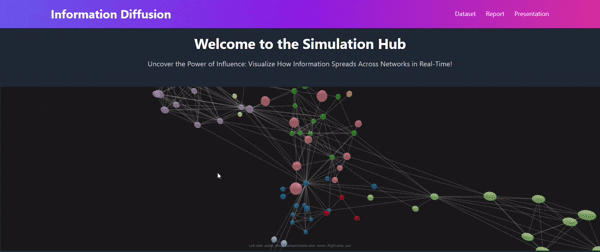
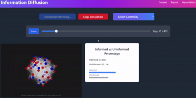

# LiveODew

Capstone work on **epidemic and information-diffusion models** on networks: compartmental SIR/SIS-style dynamics, simple ODE “info spread” (SI), and graph visualizations (structure, centrality). Notebooks live under `Simulation_and_Models/`; datasets and references stay in their folders.

## Title card

## Visuals

**Datasets**

**Graph structure**

**Centrality**

**Simulation demo**

## Reports

- [Capstone report (phase 2)](docs/reports/capstone-report-phase-2.pdf)
- [Math of epidemiology and network science](docs/reports/capstone-math-epidemiology-network-science.pdf)
- [Group project report](docs/reports/project-report-group-259.pdf)

External tracking (Google Docs, if you still have access):

- [Project tracking](https://docs.google.com/document/d/1KIGjuDIvei_1Zp37cfFnY_JU1wY9CGw04cyIHRYPxWs/edit)
- [Report 1](https://docs.google.com/document/d/1ZU5PDYLBN0BoZzXguszbsY5vJB6EhdnBsCK9DGHMZLM/edit?usp=sharing)

## Code

| Path | Notes |
| --- | --- |
| [`Simulation_and_Models/Compartmental_models_of_disease_spread/`](Simulation_and_Models/Compartmental_models_of_disease_spread/) | SIR / SIS notebooks |
| [`Simulation_and_Models/(SI)_very_simple_info_diffusion_using_ode/`](Simulation_and_Models/(SI)_very_simple_info_diffusion_using_ode/) | SI-style info diffusion (ODE) |
| [`Datasets_/`](Datasets_/) | Data used in the notebooks |
| [`References/`](References/) | Papers and notes |

Open the `.ipynb` files in Jupyter. Folder names with parentheses are unchanged so existing notebook paths keep working.
